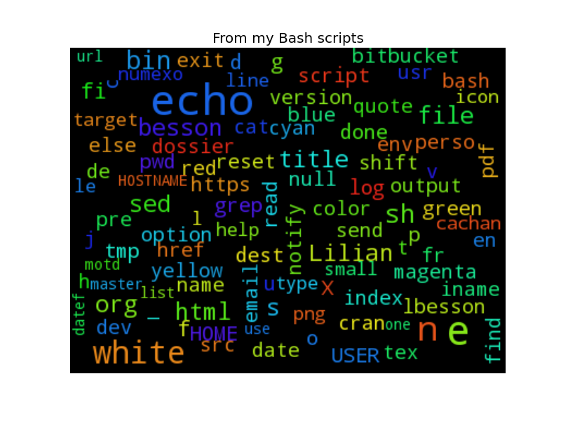

# ``generate-word-cloud.py``
A simple Python :snake: script to generate a square wordcloud :cloud: from one (or more) text file(s).
Supporting both Python 2 and 3 (2.7+ and 3.4+).
[](https://pypi.python.org/pypi/generatewordcloud)


> Based on the great [word_cloud](https://github.com/amueller/word_cloud/) module by [@amueller](https://github.com/amueller/).

[](https://pypi.python.org/pypi/generatewordcloud/)
[](https://pypi.python.org/pypi/generatewordcloud/)
[](https://pypi.python.org/pypi/generatewordcloud/)
[](https://pypi.python.org/pypi/generatewordcloud/)
[](https://pypi.python.org/pypi/generatewordcloud/)
[](https://pypi.python.org/pypi/generatewordcloud/)

----

## How to use it?
### 1. [Requirements](requirements.txt)
The usual module [matplotlib](http://matplotlib.org/) is needed for the plotting,
[docopt](https://github.com/docopt/docopt) is needed for the command line interface,
and [word_cloud](https://github.com/amueller/word_cloud/) is needed for the actual work (generating the cloud of words after reading the files).

The required Python (2 or 3) modules can be installed with [pip](http://pip.readthedocs.io/), either directly:

```bash
# Directly:
sudo pip install matplotlib docopt word_cloud
```

Or with the [requirements.txt](requirements.txt) file:
```bash
sudo pip install -r requirements.txt
```

*Note*: if [ansicolortags](https://pypi.python.org/pypi/ansicolortags) is available, it will be used to print nice colors in the help and during the generation of word clouds.

### 2. Installation
Clone the repository, copy the [script (generate-word-cloud.py)](./generate-word-cloud.py) somewhere in your PATH (e.g., ``~/.local/bin/``).

You can also just download the script itself:

```bash
$ wget https://raw.githubusercontent.com/Naereen/generate-word-cloud.py/master/generate-word-cloud.py
$ cp generate-word-cloud.py /path/to/a/directory/in/your/PATH/
```

Note: The script is *also* available from [PyPI](https://pypi.python.org/pypi/) : [pypi.python.org/pypi/generatewordcloud](https://pypi.python.org/pypi/generatewordcloud).
You can install it using [pip](http://www.pip-installer.org/).

```bash
$ pip install generatewordcloud
$ # Or maybe you need sudo rights:
$ sudo pip install generatewordcloud
```

[](https://pypi.python.org/pypi/generatewordcloud/)
[](https://pypi.python.org/pypi/generatewordcloud/)
[](https://pypi.python.org/pypi/generatewordcloud/)
[](https://pypi.python.org/pypi/generatewordcloud/)
[](https://pypi.python.org/pypi/generatewordcloud/)
[](https://pypi.python.org/pypi/generatewordcloud/)

----

### 3. Usage
#### Help:
```bash
$ generate-word-cloud.py --help
```

#### From one or two files
Generate a wordcloud from two `txt` files in the current directory, save it to `wordcloud_txt.png`.

```bash
$ generate-word-cloud.py -o ./wordcloud_txt.png ./file1.txt ./file2.txt
```

Generate a wordcloud from the textfile `hamlet.txt` (~ 8000 lines), saving to `hamlet.png`:

```bash
$ generate-word-cloud.py -o ./hamlet.png ./hamlet.txt
```


(It should work on pretty big text files without any issue.)

----

## Other examples
### From a lot of Python scripts (~ 200) :snake:


### From a lot of Bash scripts (~ 150) :shell:


### From a lot of LaTeX files (~ 180) :eggplant:


### :art: Meta example
Generate a wordcloud from the [README.md](./README.md) and [generate-word-cloud.py](./generate-word-cloud.py) files **of this very project**, save it to `wordcloud_meta.png`!

```bash
$ generate-word-cloud.py -o ./wordcloud_meta.png ./*.md ./*.py
```


----

## Features
- [x] Support one or more input file(s), will cleanly skip any file it fails to find or fails to read,
- [x] Custom output file, won't be overwritten (except with `-f` flag),
- [x] Nice command line interface ([argparse](https://docs.python.org/2.7/library/argparse.html) powered). I switched to [docopt](https://github.com/docopt/docopt) after realizing how awesome it is!
- [x] Has a command line option for every important parameter (max nb of words, width, height etc).
- [x] Input filenames with spaces in their name were seen as several files (e.g. ``this file.txt``), FIXED with the switch to [docopt](https://github.com/docopt/docopt).

----

## :page_with_curl: Complete documentation (`--help`)
```
$ generate-word-cloud.py -h | --help
Usage:
  generate-word-cloud.py [-s | --show] [-f | --force] [-o OUTFILE | --outfile=OUTFILE]
                         [-t TITLE | --title=TITLE] [-m MAX | --max=MAX]
                         [-w WIDTH | --width=WIDTH] [-H HEIGHT | --height=HEIGHT]
                         INFILE...
  generate-word-cloud.py (-h | --help)
  generate-word-cloud.py (-v | --version)

Options:
  -h --help            Show this help message and exit.
  -v --version         Show program's version number and exit.
  -s --show            Show the image but do not save it [default False].
  -f --force           Force to write the image, even if present (default is to ask before overwriting an existing file) [default False].
  -o OUTFILE --outfile=OUTFILE
                       Filename for the generated image [default 'wordcloud.png'].
  -t TITLE --title=TITLE
                       Title for the image [default None].
  -m MAX --max MAX
                       Max number of words to display on the cloud word [default 150].
  -w WIDTH --width WIDTH
                       Width of the generate image [default 400].
  -H HEIGHT --height HEIGHT
                       Height of the generate image [default 300].
  INFILE               A text file to read.
```

----

## :memo: TODO
- [x] Start it, from [this example](https://github.com/amueller/word_cloud/blob/master/examples/simple.py),
- [x] Run it on some interesting examples, embed them here (as images),
- [X] Check on weird encodings? (i.e., not UTF-8). It works fine!
- [X] Test it against :closed_book: VERY large files (million of line) ? It works fine, slowly but fine.
- [X] Test it against :books: LOTS of files (several thousands) ? It works fine, slowly but fine.
- [X] Publish it on PyPI: it is available at [pypi.python.org/pypi/generatewordcloud/](https://pypi.python.org/pypi/generatewordcloud/)
- [ ] Write a small article about it for [my blog](http://perso.crans.org/besson/).

### :bug: Knows issues
- [ ] Only tested on (X)Ubuntu (15.10), but it should work on other GNU/Linux distribution and Mac OS X (and probably Windows), if they support [docopt](https://github.com/docopt/docopt) and has both [docopt](https://github.com/docopt/docopt) and [word_cloud](https://github.com/amueller/word_cloud/) installed.

### :bug: **Unknown issues?**
> [Use the issue tracker](https://github.com/Naereen/generate-word-cloud.py/issues/new) to notify me of a bug!

----

## About
### *Why write this script?*
> There already is a lot of [good cloud word generator online](https://duckduckgo.com/?q=cloud+word+generator&ia=web), e.g. [wordle.net](http://www.wordle.net/).

1. I wanted a way to visualize the major keywords of Bash and Python (my two [favorite programming languages](https://wakatime.com/@lbesson)) and of Markdown/Strapdown, reStructuredText and LaTeX (my favorite typeset documents system),
2. The original project [word_cloud](https://github.com/amueller/word_cloud/) seemed cool. And it is. Great job [@amueller](https://github.com/amueller/) :clap: !
3. [Clouds of words are interesting](https://www.academia.edu/20224642/)! And Python is awesome!

### Author
> [Lilian Besson (Naereen)](https://github.com/Naereen/).

## :scroll: License ? [](https://github.com/Naereen/generate-word-cloud.py/blob/master/LICENSE)
This plug-in is published under the terms of the [GPLv3 License](http://www.gnu.org/licenses/gpl.html) (file [LICENSE.txt](LICENSE.txt)),
© [Lilian Besson](https://GitHub.com/Naereen), 2016.

[](https://GitHub.com/Naereen/generate-word-cloud.py/graphs/commit-activity)
[](https://GitHub.com/Naereen/ama)
[](https://GitHub.com/Naereen/generate-word-cloud.py/)
[](https://www.python.org/)

[](http://ForTheBadge.com)
[](https://GitHub.com/)

[](https://GitHub.com/Naereen/)
